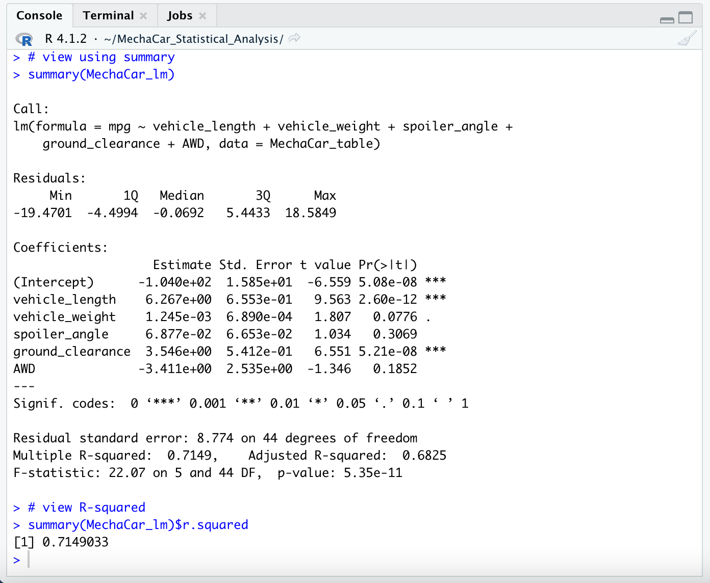
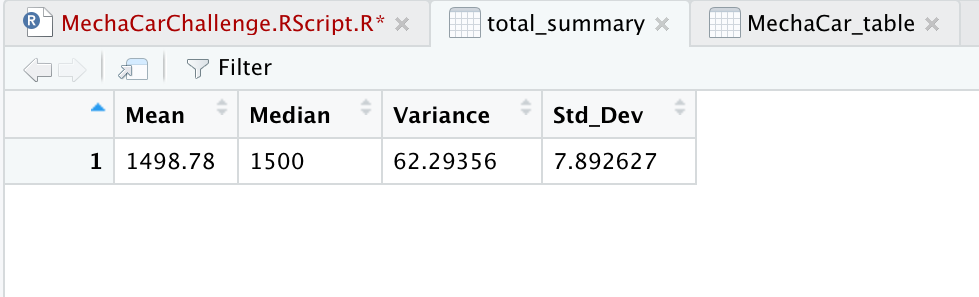
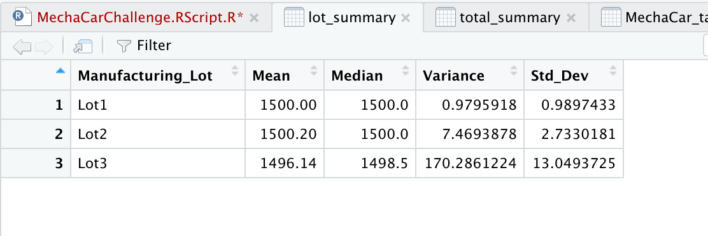
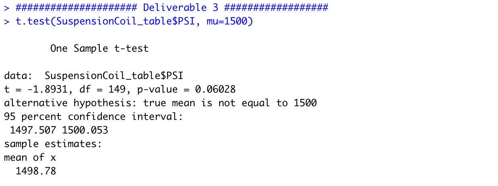
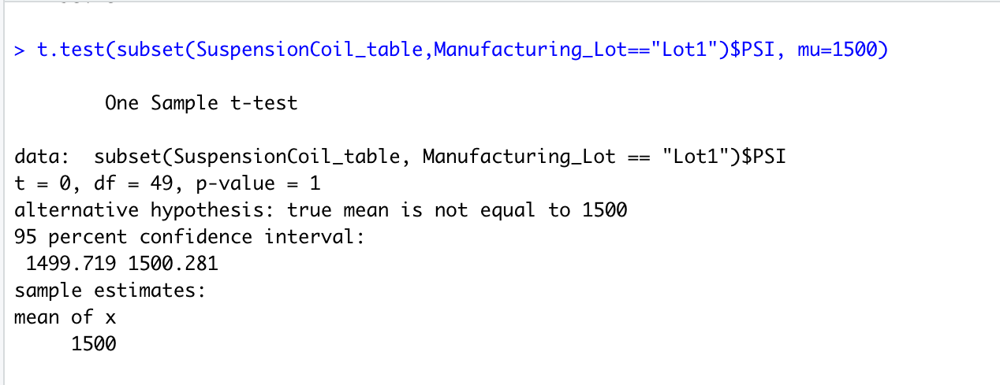
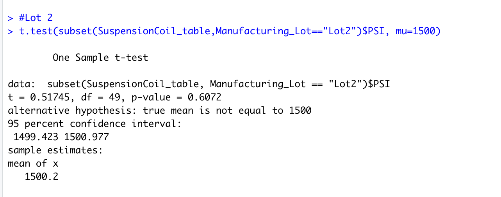
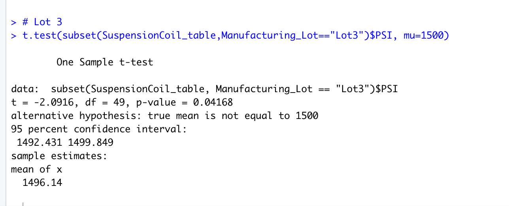

# MechaCar_Statistical_Analysis

# Background
>A few weeks after starting his new role, Jeremy is approached by upper management about a special project. AutosRUs’ newest prototype, the MechaCar, is suffering from production troubles that are blocking the manufacturing team’s progress. AutosRUs’ upper management has called on Jeremy and the data analytics team to review the production data for insights that may help the manufacturing team.

>1.Perform multiple linear regression analysis to identify which variables in the dataset predict the mpg of MechaCar prototypes

>2.Collect summary statistics on the pounds per square inch (PSI) of the suspension coils from the manufacturing lots

>3.Run t-tests to determine if the manufacturing lots are statistically different from the mean population

>4.Design a statistical study to compare vehicle performance of the MechaCar vehicles against vehicles from other manufacturers. For each statistical analysis, you’ll write a summary interpretation of the findings.

# Overview
> *Deliverable 1: Linear Regression to Predict MPG.
> *Deliverable 2: Summary Statistics on Suspension Coils.
> *Deliverable 3: T-Test on Suspension Coils.
> *Deliverable 4: Design a Study Comparing the MechaCar to the Competition.

## Linear Regression to Predict MPG
A multiple linear regression model was created that can predict the mpg of MechaCar prototypes using multiple metrics, such as vehicle length, vehicle weight, spoiler angle, drivetrain, and ground clearance. 

## Asks:

* Which variables/coefficients provided a non-random amount of variance to the mpg values in the dataset?
The variables that provide a significant contribution to the multiple linear model with p-values well below 0.001 are vehicle_lenght, and ground_clearance as well as the intercept. 

* Is the slope of the linear model considered to be zero? Why or why not?
The p-value is much smaller than our assumed signicance level of 0.05%.Therefore slope of the linear model is not considered to be zero.

* Does this linear model predict mpg of MechaCar prototypes effectively? Why or why not?
According to the summary output, the r-squared value is 0.715 which indicates that there is a strong positive correlation. However do to the intercept value we can conclude that there might be other variables that explain the variability of our dependent variable(mpg).

## Summary Statistics on Suspension Coils
Will create a summary statistics table to show:
* The suspension coil’s PSI continuous variable across all manufacturing lots
* The following PSI metrics for each lot: mean, median, variance, and standard deviation.

## Lot Summary

## Asks:
* The design specifications for the MechaCar suspension coils dictate that the variance of the suspension coils must not exceed 100 pounds per square inch. Does the current manufacturing data meet this design specification for all manufacturing lots in total and each lot individually? Why or why not?
In total the specification are met with variance of 62.29( less than 100). Although, when viewed by lots , Lots 1 & 2 are within specifications;however Lot 3 has a variance that exceeds specifications of 100 PSI.

## T-Tests on Suspension Coils
>Using your knowledge of R, perform t-tests to determine if all manufacturing lots and each lot individually are statistically different from the population mean of 1,500 pounds per square inch.

## All manufacturing lots

## Lot 1

## Lot 2

## Lot 3

## Summary of findings for the t-test
According to the t-test for all manufacturing lots with a p-value of 0.06028 we can conclude that all lots are not significantly different from the population mean.Therefore we can not reject the null hypothesis.

1.According to lot 1 with a p-value of 1, we can conclude that Lot 1 is not significantly different from the population mean.Fail to reject the null hupothesis.

2.According to lot 2 with a p-value of 0.6072,we can conclude that Lot 1 is not significantly different from the population mean. Fail to reject the null hypothesis.

3.According to lot 3 with a p-value of 0.042, lot 3 is significantly different from the population mean. Null hypothesis rejected, the sample mean and the presumed population mean are not statistiscally different.

## Study Design: MechaCar vs Competition
>Using your knowledge of R, design a statistical study to compare performance of the MechaCar vehicles against performance of vehicles from other manufacturers.

*Before starting the analysis it is important to specify what car models will be compared to MechaCar. Out of those cars which are the most popular models.*

## Asks:
* What metric or metrics are you going to test?
An additional metric that could be used is horsepower( or a surrogate measure like engine sizze or cylinders).Often times manufactures note that the smaller the engine size results in improved mpg.Another would be Engine type ( Electric, Hybrid, Gasoline, Diesel)
* What is the null hypothesis or alternative hypothesis?
Null Hypothesis (Ho): There is statistical difference between engine performance between MechaCar and Competition.
Alternative Hypothesis(Ha):There is NO statistical difference between engine performance between MechaCar and Competition.
* What statistical test would you use to test the hypothesis? And why?
To test the hypothesis we will create a multiple linear regression that will help to determine the factors that have the greatest correlation with the mpg, and which of those has the greatest impact on mpg.
* What data is needed to run the statistical test?
We will require mpg,horsepower,engine type, vehicle_lenght and ground_clearance data for at least 3 years for both MechaCar and its compable models.

